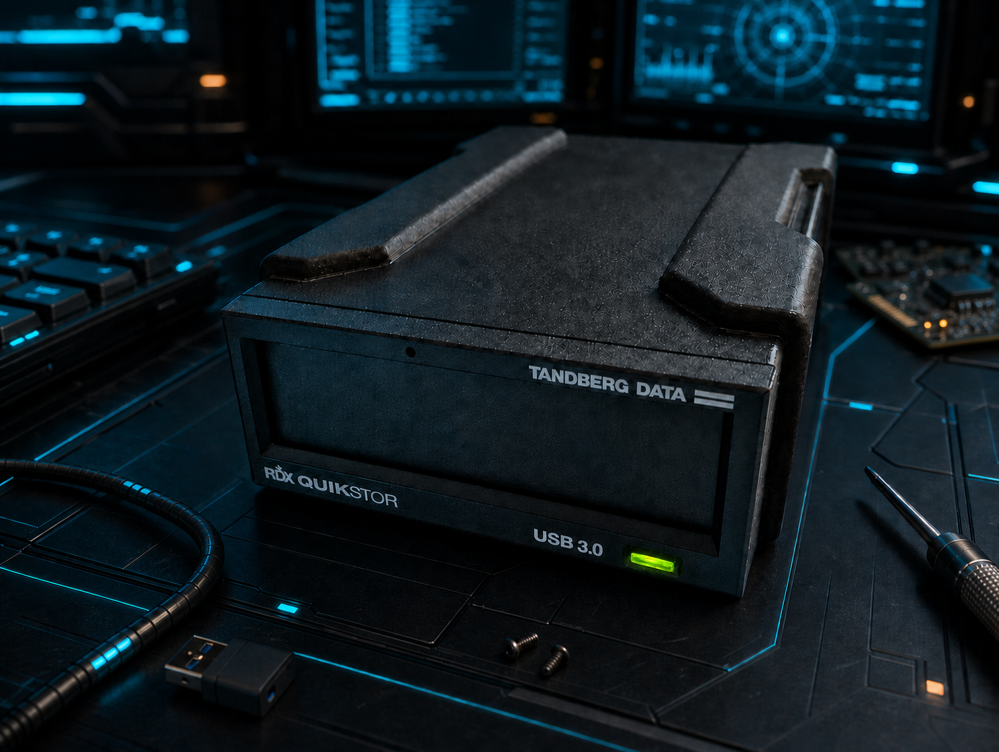

<h1 align="center">OpenRDX</h1>

  

<h2 align="center">Use standard SATA drives in your RDX dock.</h2>

> [!IMPORTANT]
> **OpenRDX is not limited to RDX cartridges.** It also supports compatible,
> unlocked **standard SATA drives** in the supported RDX dock, while retaining
> RDX cartridge support.
>
> Compatibility is guarded, but not every disk is promised to work. See the
> [current validation boundary](docs/reference/firmware-behavior.md#validation-boundary).

OpenRDX is firmware for the Tandberg Data RDX QuikStor external USB 3.0
compatibility receiver. It keeps the familiar removable-drive experience while
opening the dock to qualifying standard SATA media.

## Why OpenRDX

| Flexible media | Familiar operation | Guarded access |
| --- | --- | --- |
| Use supported RDX cartridges or qualifying standard SATA drives. | Keep one removable USB drive, safe eject behavior, and RDX cartridge write protection. | Media must pass admission checks before it becomes available to the host. |

## Choose your media

| Media | What OpenRDX provides | What to expect |
| --- | --- | --- |
| RDX cartridge | The cartridge workflow, identity, protected data area, and supported management features. | A cartridge must retain valid identifying information and pass its access checks. |
| Standard SATA drive | Direct access to the drive's native capacity after guarded admission. | The drive must be compatible and unlocked. Support is not a guarantee for every HDD or SSD. |

Both paths appear through the same stable removable USB drive. An empty bay or
rejected medium stays safely unavailable instead of being silently accepted.
For everyday operation, media rejection, ejection, and write protection, read
[Using OpenRDX](docs/getting-started/using-openrdx.md).

## Supported hardware

OpenRDX currently targets one receiver family only:

- Tandberg Data RDX QuikStor external USB 3.0 compatibility receiver;
- built around the Texas Instruments TUSB9261; and
- identified before installation by preinstalled vendor firmware revision `0283`.

After installation, OpenRDX reports receiver revision `0001` instead.

Support for other RDX docks, bridge chips, or receiver revisions is not implied.

## Experimental status

OpenRDX is experimental and incomplete. Hardware validation and compatibility
coverage are limited, and unknown issues may affect normal operation with RDX
cartridges or standard SATA drives. Full reliability and complete RDX Manager
compatibility are not yet established.

See [Firmware behavior](docs/reference/firmware-behavior.md#validation-boundary)
for detailed evidence, known limitations, and remaining validation work.

## Get started

### Install OpenRDX

Download the complete `OpenRDX-v<version>.zip` installation bundle from
[GitHub Releases](https://github.com/SunboX/OpenRDX/releases). Start with the
[OpenRDX 1.06 release notes](docs/releases/v1.06.md), verify the bundled
checksums, and follow its `OPENRDX_USB_UPDATE.md` copy of the
[guarded installation guide](docs/getting-started/installation.md).

Each release includes the firmware container, continuous FlashBurner image,
manifest, checksums, Windows updater, and matching installation instructions.
The checked-in `dist/` directory remains a historical snapshot, not a verified
release for current `main`.

Git preserves the exact bytes of generated `dist/` files so release checksums
remain valid across checkout platforms and source archives.

Firmware installation changes the receiver and requires Windows, stable USB
power, an empty bay, and careful target selection. Read the safety procedure in
full before starting.

For a receiver already running OpenRDX, follow
[Update existing OpenRDX](docs/getting-started/installation.md#update-existing-openrdx).

### Build from source

Maintainers can start with the [common build and test guide](docs/development/building.md).

GitHub Actions builds and tests every push or merge to `main`, and can also be
run manually. Publishing a versioned GitHub release runs the same process for
its exact tag and attaches the installation and compiler-output artifacts.
Ordinary pushes do not publish releases. See the
[release process](docs/development/release-process.md) for versioning and
publication instructions.

## Documentation

- [Documentation index](docs/README.md) — choose the authoritative guide for
  installation, use, development, or reference.
- [Using OpenRDX](docs/getting-started/using-openrdx.md) — media, write
  protection, ejection, and supported management behavior.
- [Install OpenRDX](docs/getting-started/installation.md) — guarded update
  workflow for the supported receiver.
- [Build and test](docs/development/building.md) — supported toolchains,
  commands, and artifact roles.
- [Release process](docs/development/release-process.md) — generate and verify
  a complete release bundle.
- [Firmware recovery](docs/development/rom-loader-recovery.md) — recovery and
  restoration instructions.
- [Firmware behavior](docs/reference/firmware-behavior.md) — implementation
  detail and the hardware-validation boundary.

## License

OpenRDX was created by André Fiedler / aka SunboX.

Repository-owned OpenRDX software is offered under
`AGPL-3.0-or-later`. OpenRDX documentation and non-code media are offered under
`CC-BY-SA-4.0` where identified by `.reuse/dep5`. Texas Instruments material and
third-party documentation retain their own notices and terms.

The public license does not grant permission for use that cannot comply with its
terms. A separate commercial or proprietary license may be available from the
copyright holder. See [`LICENSE`](LICENSE),
[`COMMERCIAL-LICENSE.md`](COMMERCIAL-LICENSE.md), and [`NOTICE`](NOTICE).
