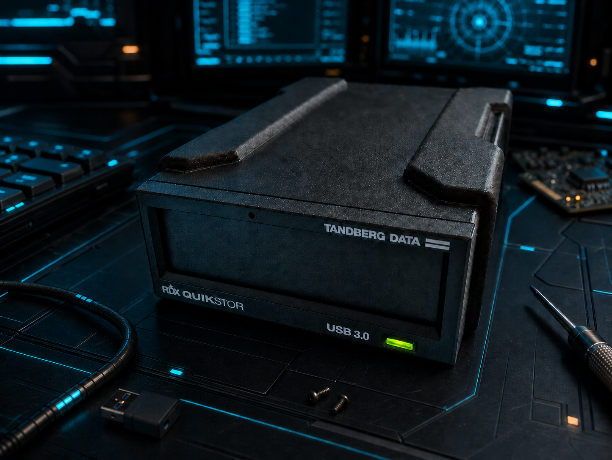

<h1 align="center">OpenRDX</h1>

  

<h2 align="center">Use standard SATA drives in your RDX dock.</h2>

> [!IMPORTANT]
> **OpenRDX is not limited to RDX cartridges.** It also supports compatible,
> unlocked **standard SATA drives** in the supported RDX dock, while retaining
> RDX cartridge support.
>
> Compatibility is guarded, but not every disk is promised to work. See the
> [current validation boundary](docs/reference/firmware-behavior.md#validation-boundary).

OpenRDX is firmware for the Tandberg Data RDX QuikStor external USB 3.0
compatibility receiver. It keeps the familiar removable-drive experience while
opening the dock to qualifying standard SATA media.

Current firmware version: **1.11**.

## Why OpenRDX

| Flexible media | Familiar operation | Guarded access |
| --- | --- | --- |
| Use supported RDX cartridges or qualifying standard SATA drives. | Keep one removable USB drive, safe eject behavior, and RDX cartridge write protection. | Media must pass admission checks before it becomes available to the host. |

## Choose your media

| Media | What OpenRDX provides | What to expect |
| --- | --- | --- |
| RDX cartridge | The cartridge workflow, identity, protected data area, and supported management features. | A cartridge must retain valid identifying information and pass its access checks. |
| Standard SATA drive | Direct access to the drive's native capacity after guarded admission. | The drive must be compatible and unlocked. Support is not a guarantee for every HDD or SSD. |

Both paths appear through the same stable removable USB drive. An empty bay or
rejected medium stays safely unavailable instead of being silently accepted.

Version 1.10 adds full manufacturing-data restore from a saved backup using
OpenRDXManager. It preserves neighboring flash data, verifies the complete result,
and requires a manual restart to activate the restored identity. Existing
serial-repair and firmware-update protections remain in place. See the
[1.10 release notes](docs/releases/v1.10.md) for details.

Version 1.11 avoids counting completed USB OUT bytes twice when a
SCSI command fails. The BOT cleanup regression test covers completed, partial,
active and repeated cleanup. A preceding 1.10 candidate passed the
automated regression tests and a TI target build. The corrected native TI 5.2.5
image subsequently completed a real firmware update through OpenRDXManager on
Windows, followed by an independent complete SPI comparison. The existing
published 1.10 release bundle is unchanged. See the
[native Windows update verification](docs/development/native-windows-update-2026-10-08.md)
for the exact artifact and receiver scope.

Version 1.11 also explicitly initializes the manufacturing-write safety
lock at boot. TI ARM9 COFF does not zero uninitialized static storage, so the
previous declaration could block updates even without a manufacturing write.
The latch still remains set after a real mutation until boot; no command clears
or bypasses it. The distributed 1.10 bundle is unchanged. On the verified receiver,
a personalized J7 ROM-loader bootstrap restored and preserved the exact same-unit
records, then enabled the normal Manager update to the corrected production image.
An already blocked receiver still requires an independently qualified recovery
procedure; this single-unit result does not qualify arbitrary full-image rollback.

For everyday operation, media rejection, ejection, and write protection, read
[Using OpenRDX](docs/getting-started/using-openrdx.md).

Version 1.11 preserves the cartridge's admitted data capacity when a host
queries its cache settings. The fix applies to Windows, macOS and Linux hosts.
Previously that query re-ran the initialization
IDENTIFY parser, advertising raw SATA capacity while retaining the RDX data-area
offset. Reads and GPT formatting near the reported end could then fail with
“LBA out of range.” The runtime refresh now updates only cache-enable bits under
the existing media-epoch and ATA ownership guards. The TI 5.2.5 candidate passed
automated checks and a normal Manager update with complete SPI verification on
the selected Windows receiver. Read-only hardware checks then confirmed readable
end sectors and stable capacity across cache queries. Successful hardware
formatting still requires a separate test; see the
[native Windows verification](docs/development/native-windows-update-2026-10-08.md#cartridge-capacity-refresh-candidate).

See the [1.11 release notes](docs/releases/v1.11.md) for all changes and the
validation boundary. The earlier hardware evidence applies to the identified
1.10 candidate images; the versioned 1.11 release requires its own device checks.

## Supported hardware

OpenRDX currently targets one receiver family only:

- Tandberg Data RDX QuikStor external USB 3.0 compatibility receiver;
- built around the Texas Instruments TUSB9261; and
- identified before installation by the receiver identifier `0283`.

Support for other RDX docks, bridge chips, or receiver revisions is not implied.

## Experimental status

OpenRDX is experimental and incomplete. Hardware validation and compatibility
coverage are limited, and unknown issues may affect normal operation with RDX
cartridges or standard SATA drives. Full reliability and complete RDX Manager
compatibility are not yet established.

See [Firmware behavior](docs/reference/firmware-behavior.md#validation-boundary)
for detailed evidence, known limitations, and remaining validation work.

## Get started

### Install OpenRDX

Use a newly generated, complete, verified release bundle and follow the
[guarded installation guide](docs/getting-started/installation.md).

Git preserves the exact bytes of generated `dist/` files so release checksums
remain valid across checkout platforms and source archives.

Firmware installation changes the receiver and requires Windows, stable USB
power, an empty bay, and careful target selection. Read the safety procedure in
full before starting.

First installation requires an installation/recovery workflow that preserves the
receiver's own manufacturing and state records. The bundled compatibility
installer is disabled, and running OpenRDX rejects legacy full-chip erase commands.
Saved settings updates also exclude overlapping USB flash requests.
For an incorrect receiver serial, see the guarded
[serial-number repair procedure](docs/development/serial-number-repair.md).

For a receiver already running OpenRDX, follow
[Update existing OpenRDX](docs/getting-started/installation.md#update-existing-openrdx).

### Build from source

Build the firmware and its installation bundle with the
[common build and test guide](docs/development/building.md).

The distribution regression fixture disables SCons tool autodetection for both
explicit and default environments, so the test works with PlatformIO's reduced
Windows SCons package without requiring its omitted MSVC support modules.

## Documentation

- [Documentation index](docs/README.md) — choose the authoritative guide for
  installation, use, development, or reference.
- [Using OpenRDX](docs/getting-started/using-openrdx.md) — media, write
  protection, ejection, and supported management behavior.
- [Install OpenRDX](docs/getting-started/installation.md) — guarded update
  workflow for the supported receiver.
- [Build and test](docs/development/building.md) — supported toolchains,
  commands, and artifact roles.
- [Release process](docs/development/release-process.md) — generate and verify
  a complete release bundle.
- [Firmware recovery](docs/development/rom-loader-recovery.md) — recovery and
  restoration instructions.
- [Firmware behavior](docs/reference/firmware-behavior.md) — implementation
  detail and the hardware-validation boundary.

## License

OpenRDX was created by André Fiedler / aka SunboX.

Repository-owned OpenRDX software is offered under
`AGPL-3.0-or-later`. OpenRDX documentation and non-code media are offered under
`CC-BY-SA-4.0` where identified by `.reuse/dep5`. Texas Instruments material and
third-party documentation retain their own notices and terms.

The public license does not grant permission for use that cannot comply with its
terms. A separate commercial or proprietary license may be available from the
copyright holder. See [`LICENSE`](LICENSE),
[`COMMERCIAL-LICENSE.md`](COMMERCIAL-LICENSE.md), and [`NOTICE`](NOTICE).
