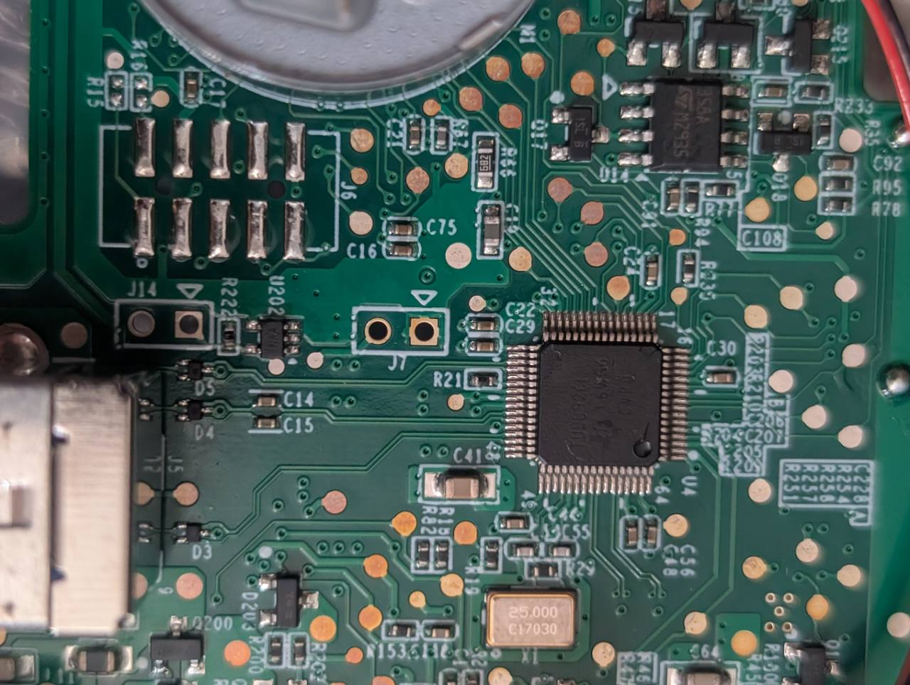
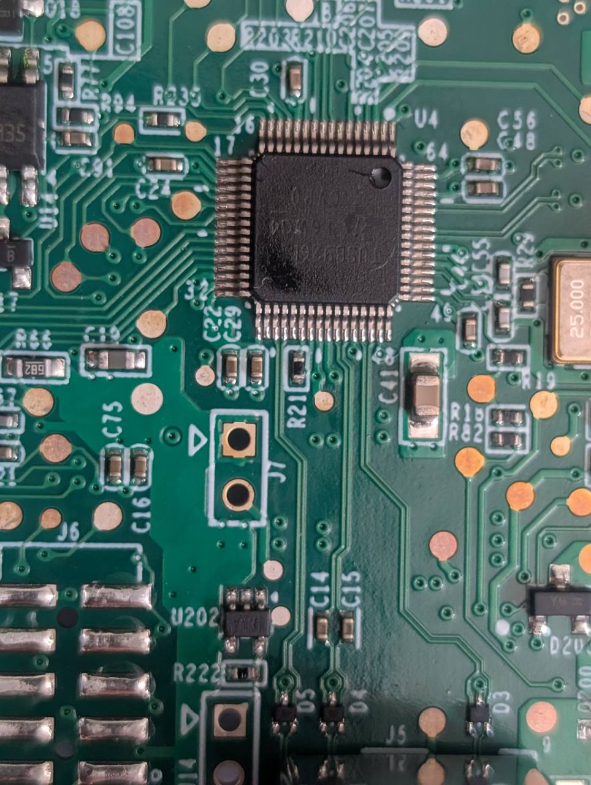

# J7 ROM-loader recovery and firmware restoration

## Purpose

This standalone procedure uses Texas Instruments TUSB926x FlashBurner through
the board's `J7` ROM-loader entry path. Choose the image before connecting power:

- To restore the a receiver backup and per-unit data, use the same receiver's
  complete SPI backup with **Program Full Binary Image**. The TI operation is
  documented; its use with the retained 256 KiB capture is an **UNVALIDATED /
  EXPERIMENTAL** procedure and has not been hardware-tested in this project.
- The continuous application HEX with normal **Program** has been physically
  exercised with earlier builds, but that evidence does not prove preservation
  of the receiver's manufacturing or state records. Use it only within a
  recovery plan that restores and verifies those records from this same receiver.
- The downloadable `0283` compatibility update envelope is not a validated FlashBurner
  input. Downloading it alone does not provide a ready-to-flash SPI image.

The `J7` sequence works with blank flash or an application that does not expose
the ROM loader. No intermediate OpenRDX installation is required for the
full-image route.

> [!CAUTION]
> This is a board-access recovery and development procedure, not the normal
> customer installation path. It requires an operator who can identify the
> supported hardware, verify unpowered connections, and recover safely from a
> failed programming attempt.

No build or test command in this repository writes to hardware. Programming is
always a separate, deliberate operator action.

The bundled compatibility installer and its `-RestoreOpenRDX` alias are disabled
before staging. Use an OpenRDX Manager installation/recovery workflow that backs up,
restores, and verifies receiver-specific records. A generic FlashBurner success
result or an application-only HEX is insufficient. If a record-preserving
workflow is unavailable, stop before entering the ROM loader or programming.

## Safety requirements

- Disconnect USB and every other power source before fitting, reseating,
  positioning, or adjusting a PCB bridge, and before making continuity
  measurements. Numbered step 6 below is the one intentional live-removal
  exception after ROM enumeration.
- Never use a meter or make resistance or continuity measurements on a powered
  board.
- Confirm the `J7` pad connections on the unpowered board before using the
  bridge. Board revisions may differ.
- Do not short the 3.3 V pad to ground. The round pad of nearby `J14` is ground
  and must not be used for this procedure.
- Use a secured, insulated, removable link that cannot slip onto adjacent
  components and can be lifted straight clear without approaching adjacent
  conductors. Never use loose tweezers as the bridge.
- Never fit, reseat, or adjust the link while powered. If it cannot be removed
  safely exactly as step 6 describes, stop and disconnect USB before touching
  it.
- Step 6 removes the already secured `J7` link after the ROM bootloader
  enumerates and before probing or programming the SPI flash. It is the only
  intentional live-removal exception in this procedure.
- Require exactly one selected bootloader instance. Do not program when target
  identity or flash presence is ambiguous.
- A complete raw dump contains receiver-specific manufacturing and state data.
  Never write one receiver's full dump to another receiver.
- Treat all SPI contents, including the manufacturing record at `0x3E000` and
  state record at `0x3F000`, as erasable during a FlashBurner operation. The
  full-image route must restore those records from the same receiver's backup;
  normal application programming does not prove their preservation.
- Record the receiver's serial number and preserve a verified, read-only raw
  backup before direct programming whenever the existing flash is readable.
- Do not disconnect power, move the bridge, or disturb USB while a programming
  transaction is running.

## Required software

- Windows with administrator access.
- Texas Instruments TUSB926x FlashBurner and its device driver.
- For an OpenRDX build only, the supported Windows TI ARM Code Generation Tools
  5.2.5 environment and PlatformIO setup from the
  [common build guide](building.md).
- For receiver restoration, the verified same-unit full-flash backup described
  below. Keep a separate immutable copy before programming.

The TUSB9261 ROM bootloader enumerates as USB VID `0451`, PID `926B`. A usable
target must expose both its HID interface and the **TUSB9260 Flash Burner
Driver** without Device Manager warnings.

FlashBurner accepts an application `.bin` or Intel HEX `.hex` file through its
normal **Program** operation. Texas Instruments documents **Program Full Binary
Image** for an already formatted binary previously generated with FlashBurner's
**Export** action. Never use **Program Full Binary Image** with the PlatformIO
application HEX or with the Tandberg update envelope.

## Choose the recovery image

Do not interchange the application, compatibility-update, analysis, and raw-flash
formats:

| Artifact | Intended path | Validation status |
| --- | --- | --- |
| `.pio/build/tusb9261_ti_cgt/TUSB9261_RDX_flash.hex` | FlashBurner normal **Program** through the ROM loader | Workflow physically validated with earlier checksum-pinned builds; verify the exact current build |
| `RDX2E__STD__F-0283.bin` from the image download | Compatibility update envelope; do not select in FlashBurner | Not a validated FlashBurner input |
| 256 KiB full-flash capture identified below | Same-unit **Program Full Binary Image** through the ROM loader | Experimental; acceptance, programming, and post-boot behavior not yet physically verified |
| Extracted 61,696-byte payload or 61,710-byte boot-region image | Analysis only | Not a supported programming input |

### Compatibility image for revision 0283

Overland-Tandberg's public
[USB 3.0 external firmware directory](https://www.overlandtandberg.com/ftp1-sub/rdx/RDXQuikStor/Firmware/USB/USB3.0/external/)
lists the 62,110-byte `RDX2E__STD__F-0283.bin`. Save a downloaded copy in a
local firmware archive, for example `C:\RDX-recovery\RDX2E__STD__F-0283.bin`.
This download is a compatibility update package, not the complete SPI backup needed
for the TI full-image restoration below.

An [archived copy of the published file](https://web.archive.org/web/20220104152216if_/https://ftp1.overlandtandberg.com/rdx/RDX%20QuikStor/Firmware/USB/USB3.0/external/RDX2E__STD__F-0283.bin)
is also available. Regardless of source, accept it only after the exact size and
digest checks below.

The `RDX2E__STD__F-0283.bin` envelope is 62,110 bytes and has SHA-256
`73d528801aefc032d3a53637b035f65d72809151b2f127c6b2050e9bacc76f3b`.
The ZIP has SHA-256
`7e2a33b798a92f609af12538f650d5f5056c4dc487e7f92b278d16fd4b136938`
and contains that one 62,110-byte file. The `.bin` is a signed compatibility update
envelope, not a raw SPI image.

Use PowerShell to check the downloaded archive file. These checks identify the
file; they do not convert it into FlashBurner input:

```powershell
$compatibilityImage = 'C:\RDX-recovery\RDX2E__STD__F-0283.bin'
$compatibilityFile = Get-Item -LiteralPath $compatibilityImage
if ($compatibilityFile.Length -ne 62110) {
    throw "Unexpected compatibility-image size: $($compatibilityFile.Length) bytes"
}
$expectedHash = '73d528801aefc032d3a53637b035f65d72809151b2f127c6b2050e9bacc76f3b'
$actualHash = (Get-FileHash -Algorithm SHA256 -LiteralPath $compatibilityImage).Hash
if (-not $actualHash.Equals($expectedHash, [StringComparison]::OrdinalIgnoreCase)) {
    throw "Compatibility-image checksum mismatch: $actualHash"
}
```

### Same-unit raw backup

The adjacent analysis project also contains the complete raw M25PE20 backup
from the originating receiver:

```text
../TUSB9261_RDX_*_Project/Firmware/M25PE20_RDX_*_flash_256KiB.bin
```

It is exactly 262,144 bytes (`0x40000`) with SHA-256
`058d1f0b3a22f7833106cf9e2a952ced9d8090802649e728ed5b80032c6cf5f9`.
It includes the boot region at `0x00000`, the receiver/manufacturing record at
`0x3E000`, and persistent state at `0x3F000`. Those high-flash records make it a
same-unit archive, not a distributable update image. Its embedded unit serial
is `7820999743`; never use this capture for a receiver with another serial. See
[Restore a receiver backup with TI FlashBurner](#restore-a-receiver-backup-with-ti-flashburner)
before considering any use of this file.

## Build and validate OpenRDX

Complete the tests and Windows build in
[Build and test OpenRDX](building.md). Do not proceed from an unverified or
unknown source revision.

The build produces these files under `.pio/build/tusb9261_ti_cgt`:

| File | Purpose |
| --- | --- |
| `TUSB9261_RDX.out` | TI linker output and symbol information |
| `TUSB9261_RDX.hex` | Sparse Intel HEX application image |
| `TUSB9261_RDX_flash.hex` | Continuous Intel HEX image for FlashBurner |

FlashBurner 1.3.1 rejects discontinuous Intel HEX input. The build adapter
therefore asks TI `armhex` to create `TUSB9261_RDX_flash.hex`, filling linker
gaps with `0xFF`. Use that continuous file for direct programming.

Before proceeding, record a SHA-256 digest for the exact file to be written:

```powershell
Get-FileHash -Algorithm SHA256 .pio\build\tusb9261_ti_cgt\TUSB9261_RDX_flash.hex
```

Use the freshly generated image from the intended source revision. Every normal
build also places the same continuous HEX in the versioned `dist/` bundle;
verify its manifest and checksums before use.

## Locate J7

`J7` is the two-pad footprint immediately beside the TUSB9261 marked `U4`. In
the landscape locator photo, the `J7` round pad is on the left and the square
pad beside the silkscreen triangle is on the right. `J14` is the similar
two-pad footprint farther left; it is not part of this procedure.



*Locator view: J7 is centered immediately to the left of U4. J14 is the other
two-pad footprint near the left edge.*

The close-up below is rotated about 90 degrees counter-clockwise relative to the
locator photo. Here the square/triangle-side pad is above the round pad.



*Close-up: J7 is visibly labelled between U4 and J6. The pad shapes establish
orientation only; verify their nets electrically on the unpowered board.*

## Enter the ROM bootloader

If Device Manager already shows VID `0451`, PID `926B` and the Flash Burner
driver is healthy, leave the board unchanged and continue with the read-only
probe.

If an installed application starts instead, use this board-level sequence:

1. Disconnect every source of power, including USB.
2. On the unpowered board, verify that the `J7` round pad has direct continuity
   to U10 pin 1 (`CE#`) and that the `J7` square pad has direct continuity to
   U10 pin 8 (`VCC`). Stop if either measurement differs.
3. Securely bridge the two `J7` pads.
4. Connect USB with the bridge already present. Holding flash `CE#` high during
   reset prevents application loading.
5. Wait for the TUSB9261 ROM bootloader to enumerate as VID `0451`, PID `926B`.
6. As the one intentional live-removal exception, keep USB connected and lift
   the already secured, insulated `J7` link straight clear without approaching
   adjacent conductors. Do not reseat or adjust it. The controller remains in
   its ROM bootloader while the SPI flash becomes selectable again. If a safe
   straight removal is not possible, stop and disconnect USB.
7. Visually confirm that `J7` is fully open and that the removed link cannot
   touch nearby components. Do not make an electrical measurement while USB is
   connected.

The validated `J7` nets are:

| Pad | Net | Function |
| --- | --- | --- |
| Round | U10 pin 1, `CE#` | Active-low external-flash select |
| Square | U10 pin 8, `VCC` | 3.3 V high rail, also tied to `HOLD#` and `WP#` |

There is an approximately 1 kOhm series path between controller `SPI_CS0` and
the flash-select net. Nearby `R21` is a separate 10 kOhm component and requires
no modification.

## Read-only target probe

Run the command-line tool from an elevated PowerShell session:

```powershell
& 'C:\Program Files (x86)\Texas Instruments Inc\Command Line FlashBurner\TUSB926x_CL_Burner.exe' /p
```

Proceed only when the output identifies exactly one intended instance and
reports:

```text
Flash Burner driver: Yes
Flash Present: True
```

If either field differs, disconnect power and correct the driver, bridge, or
hardware condition before attempting a write.

## Program OpenRDX on one selected instance

Recheck the SHA-256 digest and the absolute image path. Then run the elevated
command with the selected instance number and continuous HEX file:

```powershell
& 'C:\Program Files (x86)\Texas Instruments Inc\Command Line FlashBurner\TUSB926x_CL_Burner.exe' `
    /s 0 `
    /f 'D:\Projekte\OpenRDX\TUSB9261_RDX_PlatformIO\.pio\build\tusb9261_ti_cgt\TUSB9261_RDX_flash.hex'
```

Alternatively, use the GUI's normal **Program** operation with the same
continuous HEX file. Leave **Program Full Binary Image** disabled.

Wait for an explicit `Programming Succeeded` or failure result. FlashBurner's
ROM path acknowledges the transfer but does not provide a complete read-back
verification, so a successful message is not a substitute for post-boot
behavioral checks.

## Reboot and verify OpenRDX

1. After programming finishes, disconnect USB.
2. Confirm that `J7` is open.
3. Reconnect USB and allow OpenRDX to start.
4. Confirm USB VID:PID `1A5A:0005`, revision `0107` for version `1.07`
   (legacy builds may report `0001`), the expected USB serial
   (`00` plus the ten-character unit serial), and the removable-media interface.
   A changed serial is an identity failure even if USB enumeration succeeds.
5. With no cartridge inserted, confirm that the eject-button LED is steady
   amber and the cartridge LED is off. Insert a cartridge and confirm that the
   cartridge LED becomes green before entering its activity blink state while
   the eject-button LED remains amber.
6. Confirm media discovery and read-only commands before attempting writes.
7. Record the programmed image digest, device identity, and verification
   results.

If OpenRDX does not start, disconnect power and repeat the `J7` bootloader-entry
sequence. Do not perform any live bridge action other than the exact step 6
removal, and never move the bridge during programming.

## Restore a receiver backup with TI FlashBurner

This route writes the same-unit full SPI image directly through the ROM loader.
It does not require a running application. **UNVALIDATED / EXPERIMENTAL:** the
retained raw capture has not yet been accepted and programmed by FlashBurner,
read back, or boot-tested through this route. These are the TI GUI steps for an
operator-led recovery trial, not a claim of completed hardware validation.

### Verify the full image and receiver

Remove the cartridge. Match the receiver's pre-programming serial or label to
the backup's embedded serial `7820999743`. For a different receiver, obtain its
own full backup and independently establish its size, digest, and identity.
Do not use this capture merely because the PCB looks the same.

From PowerShell at this repository's root, resolve exactly one retained backup
and verify it before selecting anything in FlashBurner:

```powershell
$backupFiles = @(Get-Item '..\TUSB9261_RDX_*_Project\Firmware\M25PE20_RDX_*_flash_256KiB.bin' -ErrorAction Stop)
if ($backupFiles.Count -ne 1) {
    throw 'Expected exactly one same-unit full-flash backup.'
}
$fullImage = $backupFiles[0].FullName
if ($backupFiles[0].Length -ne 262144) {
    throw 'Expected a complete 262144-byte SPI image.'
}
$expectedHash = '058d1f0b3a22f7833106cf9e2a952ced9d8090802649e728ed5b80032c6cf5f9'
$actualHash = (Get-FileHash -Algorithm SHA256 -LiteralPath $fullImage).Hash
if (-not $actualHash.Equals($expectedHash, [StringComparison]::OrdinalIgnoreCase)) {
    throw 'Full-flash backup checksum mismatch.'
}
$fullImage
```

### Program the full image

1. Complete **Enter the ROM bootloader** and **Read-only target probe** above.
   Confirm VID:PID `0451:926B`, one target, healthy drivers, flash present, and
   the J7 bridge removed.
2. Open the TI TUSB926x FlashBurner GUI as administrator and select that
   bootloader instance. Use the absolute path printed by `$fullImage` to select
   the verified 262,144-byte backup.
3. In the GUI options, enable **Show the Program Full Binary Image button**.
4. Select **Program Full Binary Image**. This operation sends the selected
   image without adding a new firmware wrapper or USB descriptors. Do not use
   normal **Program** for this raw capture, and do not substitute the
   62,110-byte compatibility update envelope.
5. Wait for the explicit result while maintaining stable power and USB. If the
   tool rejects the file, save the error and stop; do not trim the image, switch
   programming modes, or retry with the compatibility envelope.
6. After completion, close FlashBurner, disconnect USB, confirm J7 is open,
   and reconnect USB to boot from SPI.

Use the GUI for this full-image operation. The CLI `/s 0 /f ...` example above
is for normal application programming and is not the full-image command.

### Verify restoration

Check the USB identity and Windows storage-device inquiry information against
the same receiver's pre-programming records: manufacturer `TANDBERG`, product
`RDX`, expected firmware revision, and ten-character unit serial
`7820999743` for the retained capture. Do not assume that the capture contains
revision `0283` merely because that version is available as a separate download.

Confirm an empty bay first, then insert a known cartridge and test discovery,
read access, and eject behavior. Save the tool version, image digest,
programming log, and observed identity.

A successful programming message alone is insufficient. Full restoration
validation also requires a complete SPI read-back compared byte-for-byte with
the input, accounting for any documented state changes after boot. FlashBurner's
**Dump SPI Flash Content** is available only through supported TI vendor-specific
SCSI commands; its availability on this RDX firmware is unproven, and it is not
a ROM-loader read-back facility. **Export Formatted Binary** generates an image
from the selected firmware and descriptors; it is not a backup read.

If boot or identity verification fails, return to J7 ROM-loader entry. Preserve
the logs and backup before deciding on another write.

### Why the downloadable firmware cannot be selected directly

`RDX2E__STD__F-0283.bin` contains a compatibility update envelope. Normal **Program**
expects application bytes or HEX; **Program Full Binary Image** expects an
already formatted SPI image. Neither action is established to decode the
compatibility envelope.

The extracted 61,696-byte payload and 61,710-byte boot-region derivative also
lack a validated TI programming profile and physical boot proof. Do not replace
the complete same-unit backup with either file. If only the image download is
available, direct TI restoration remains blocked by the missing compatible
image; the download checksum alone does not resolve that requirement.

## Evidence boundary

The photographs establish only the visible `J7` location and pad orientation on
the shown board. The pad-to-net mapping and boot-selection behavior come from
separate continuity and ROM-enumeration validation recorded for that board;
repeat the unpowered continuity checks on another board revision.

The recorded hardware exercises cover J7 entry, normal FlashBurner **Program**
with a continuous OpenRDX HEX, and OpenRDX boot. The exact current build still
requires its own post-program verification. The same-unit full-image route
above is based on TI's documented no-additional-formatting operation, but has
not been physically qualified with the retained capture.

Texas Instruments documents boot-loader recovery by disabling the SPI flash,
restoring its enable connection after ROM enumeration, normal **Program** for a
firmware `.bin` or `.hex`, and **Program Full Binary Image** for data previously
generated with **Export**. It also states that a successful programming message
is not a read-back verification. See the
[TUSB926x Flash Burner User's Guide, SLLU125D](https://www.ti.com/lit/ug/sllu125d/sllu125d.pdf),
sections 4.2, 4.5-4.8, and 5.2-5.4.

[Back to the documentation index](../README.md)
